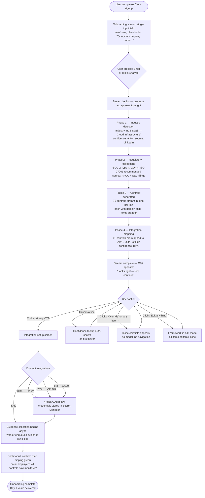
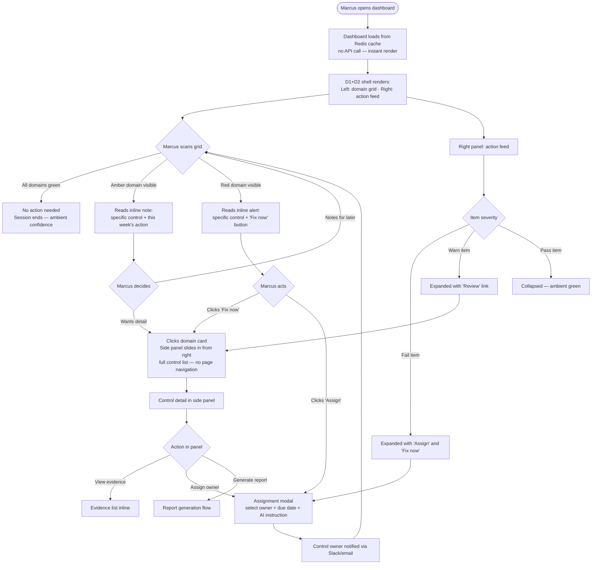
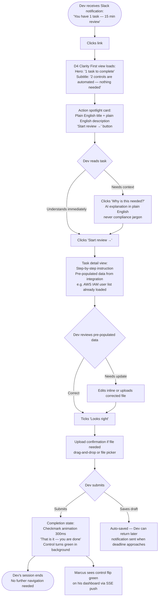
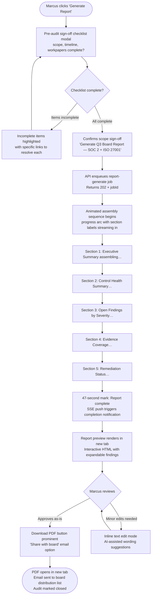

# UX Design Specification GRC

**Author:** Vijay
**Date:** 2026-05-03

---

<!-- UX design content will be appended sequentially through collaborative workflow steps -->

## Executive Summary

### Project Vision

GRC is an AI-native Governance, Risk & Compliance SaaS platform that makes compliance feel like a modern product rather than an audit obligation. The product's primary competitive weapon is design — every incumbent tool looks like enterprise software from 2003; this platform should feel like it was made by Apple, built with the spatial interaction language of Figma.

The platform serves organisations from 50–2,500 employees across five compliance frameworks (SOC 2, ISO 27001, SOX, GDPR, NIST CSF) at a price point ($299–$1,999/mo) that is structurally impossible for incumbents to match. Its AI eliminates the consultant-led setup that makes GRC artificially complex, replacing 4–12 weeks of implementation with a 90-second onboarding experience.

**Design philosophy:** Figma's spatial canvas metaphors, Apple's typographic rigour, and Linear's density-without-clutter. Dark mode from day one — not as an afterthought.

### Target Users

| Persona | Context | Core UX Need |
|---|---|---|
| **Priya** — CTO/Founder | Series B startup chasing enterprise deals | Speed to value; wants "wow" in the first 90 seconds |
| **Marcus** — Internal Audit Director | Mid-market firm running 3 frameworks simultaneously | Power + efficiency; board reports in minutes not weeks |
| **Dev** — Control Owner / Engineering Lead | Non-audit professional assigned compliance tasks | Zero friction, zero jargon; consumer-grade simplicity |
| **Sandra** — External Auditor | Mid-tier audit firm doing fieldwork | Structured evidence navigation; inline review without email chains |
| **Carlos** — Platform Admin | IT/Security Manager, Scale tier | Full control and visibility; no surprises, no manual provisioning |
| **Aisha** — Developer | DevOps engineer building custom integrations | Clear docs, working sandbox, no friction to first successful call |

**Device priority:** Desktop-first. Mobile is not a priority for MVP. The Board/Executive portal is responsive.

**Accessibility:** WCAG 2.1 Level AA across all interfaces. Status never communicated by colour alone.

### Design Language

**Primary reference: Figma's product suite** — spatial canvas thinking, floating toolbars, contextual panels, node-and-edge relationships, real-time collaboration cues, and infinite depth without overwhelm.

**Secondary references:** Apple's typographic system, Linear's information density, Vercel's dashboard aesthetic.

**Theming:** Dual theme — dark mode and light mode — both fully designed from day one. Dark mode is the default for the authenticated app shell. Light mode default for marketing/public pages.

### Key Design Challenges

1. **The multi-audience problem** — Six personas need fundamentally different experiences within the same platform.
2. **The AI fingerprinting "aha moment"** — Type a company name, watch the compliance framework stream in live with confidence scores. If it feels magical, the product sells itself.
3. **Trust without friction** — High-stakes domain requiring trust signals without bureaucratic confirmation dialogs.
4. **The control owner's first experience** — Must feel like a consumer app: plain English, one obvious action, zero training needed.
5. **Canvas learnability (Growth)** — Novel interaction for GRC; mandatory 2D fallback is a first-class experience.

### Design Opportunities

1. **Onboarding as live product demo** — The streaming fingerprinting experience converts sceptics before the first sales call.
2. **Report generation as a showstopper** — 47-second animated assembly → polished PDF is a demo centrepiece.
3. **The board portal as a strategic moat** — Once the compliance trajectory score is in the monthly board pack, cancellation requires actively removing it.
4. **The control owner experience as word-of-mouth** — If audit season becomes "actually fine", Dev tells his colleagues.

## Core User Experience

### Defining Experience

**The most important interaction in the platform is the compliance dashboard daily check-in.**

This is the loop that makes GRC a year-round product rather than a seasonal panic. Every morning, Marcus opens the dashboard and scans his control pulse. Green controls need nothing. Amber controls need attention this week. Red controls need attention today. The entire value of continuous monitoring lives or dies on how well this interaction is designed.

The interaction that *converts users* during onboarding is different: the AI fingerprinting stream. Type "Acme Software". Watch the platform build your control framework live — industry detected → regulatory obligations inferred → 73 controls pre-populated → 41 already mapped to existing tooling. All in 90 seconds, streaming in real time with confidence scores and source labels appearing alongside each item.

**The two interactions that define the product:**
1. **Onboarding stream** — the aha moment that converts trials
2. **Dashboard pulse** — the daily loop that retains customers

### Platform Strategy

- **Web application, desktop-first** — browser-based, mouse/keyboard primary
- **No offline requirement** — compliance operations require live data
- **No mobile priority for MVP** — Board/Executive portal is the exception; must be fully responsive for magic-link access
- **Canvas features (Growth) are client-only** — loaded via dynamic import, never SSR; isolated module with full 2D fallback
- **Dark mode default** for authenticated app shell; light mode default for marketing/public pages; user-switchable in settings

### Effortless Interactions

| Interaction | What "effortless" means |
|---|---|
| Evidence collection | Happens in the background via integrations. User just sees controls turn green |
| Control owner task completion | One notification → one click → one plain-English instruction → one file upload → done. Under 15 minutes, zero jargon |
| Report generation | One button. Animated assembly sequence. Polished PDF. User's only job is to click "Generate" |
| Fingerprinting review | Results stream with confidence badges and source chips. User clicks "Looks right, proceed" — not a 47-question form |
| Integration connection | OAuth flow, four clicks, credential stored. First evidence appears within minutes. No YAML, no API docs needed |

### Critical Success Moments

**Make-or-break flows:**
1. **90-second onboarding** (FR1–FR4) — Streaming animation, confidence indicators, and "override anything" affordance must all work perfectly on first run
2. **First integration → first green controls** (FR13, FR20) — Watching 41 controls flip from grey to green is the second conversion moment
3. **First report generation** (FR26) — The animated assembly followed by a beautiful PDF is a product demo moment
4. **Control owner's first task** (FR8, FR41) — Dev completes it without asking anyone for help

**Success milestones by persona:**
- Priya: First framework mapped + first integration connected (Day 1)
- Marcus: First board report generated (Week 1)
- Dev: First assigned task completed without confusion (First audit season)
- Sandra: First evidence room accessed and navigated without training (First audit)

### Experience Principles

1. **Every user sees only what they own** — Role-based information hiding eliminates cognitive overload by design, not by documentation
2. **The AI acts — it doesn't just suggest** — Evidence collects itself, gaps highlight automatically, reports assemble on command
3. **Status is always visible, action is always obvious** — Green/amber/red is the constant ambient signal; every red item surfaces a specific next action
4. **Compliance becomes a posture, not an event** — Design patterns reinforce year-round engagement, not seasonal panic
5. **Trust is earned through transparency, not gates** — AI confidence scores and source chips earn trust; confirmation dialogs do not

## Desired Emotional Response

### Primary Emotional Goal

**Calm competence.** Every interaction should make users feel like the most capable, in-control version of themselves. GRC is high-stakes — but the platform absorbs that anxiety rather than reflecting it back.

| Persona | Primary Emotion | What Produces It |
|---|---|---|
| **Priya** | Empowered | "My startup is enterprise-ready. I didn't need a consultant." |
| **Marcus** | Proud | "I produced a board-ready report in 4 minutes. That's my name on it." |
| **Dev** | Relieved | "Audit season was actually fine this year. No surprises, no all-nighters." |
| **Sandra** | Impressed | "This is the cleanest evidence room I've ever worked in." |
| **Board** | Reassured | "The compliance trajectory is green. I understand exactly where we stand." |

### Emotional Journey Mapping

| Stage | Target Emotion | Risk Emotion | Design Mechanism |
|---|---|---|---|
| **Discovery / Marketing** | Intrigued | Sceptical | Live demo embed showing fingerprinting stream |
| **Onboarding — Fingerprinting** | Wonder → Confidence | Overwhelm | Progressive reveal: industry → obligations → controls → mappings, each with confidence chips |
| **First Integration Connected** | Satisfaction | Anticlimactic | Animated control-flip sequence: grey → green, count displayed ("41 controls now monitored") |
| **Daily Dashboard** | Calm control | Anxiety | Muted palette, clear signal hierarchy; red items always surface a single specific next action |
| **Control Owner Task** | Relief | Confusion, shame | Plain English, one visible action, "that's it" confirmation state |
| **Report Generation** | Delight → Pride | Impatience | 47-second animated assembly with visible progress; polished result that looks worth sharing |
| **Error / Gap State** | Motivated | Blamed, stuck | Errors name the gap AND the fix; never blame the user; always offer the obvious path forward |
| **Return Visit** | Grounded | FOMO, dread | Ambient green signals the healthy state; only amber/red demands attention |

### Micro-Emotions to Engineer

| Emotion | Design Mechanism |
|---|---|
| **Trust** | Confidence scores with source chips on every AI output; no hidden reasoning; inline citations |
| **Calm** | Muted dark palette (no saturated surfaces); gradual state degradation (grey → amber → red, never sudden red); whitespace proportional to hierarchy |
| **Accomplishment** | Explicit completion states — control flips green, task card collapses with checkmark, report PDF loads in a new tab |
| **Delight** | Streaming text animations, the fingerprinting reveal, the report assembly sequence — reserved for high-value moments only, not sprinkled throughout |
| **Relief** | Control owner dashboard shows only what's owned; zero visible "company-wide" burden |

### Emotions to Prevent

| Emotion | Trigger to Eliminate |
|---|---|
| **Overwhelm** | Never surface full control lists without a filtered view as default; no unacted notification queues |
| **Anxiety** | Never show an amber/red state without the specific remediation path |
| **Distrust** | Never hide AI reasoning; never show a confidence score without its sources |
| **Shame** | Never frame lateness as failure in control owner UX ("Your review is 4 days overdue" → "Here's how to catch up in 10 minutes") |
| **Confusion** | Never use compliance jargon in control owner flows; every instruction in plain English with one obvious action |

### Design Implications

1. **Trust via reasoning visibility** — Every AI-generated item (control suggestion, risk score, report finding) surfaces a collapsible "why" panel with source citations and confidence percentage.
2. **Calm via palette discipline** — The dark mode palette uses desaturated slate backgrounds with a single brand accent. Status colours (amber, red) are reserved for data; they never appear in chrome, navigation, or decoration.
3. **Accomplishment via completion choreography** — State transitions are animated: control flip (200ms ease-out), task collapse (checkmark bloom 300ms), report assembly (progress arc with section labels). These are the product's applause.
4. **Delight via restraint** — The streaming fingerprinting animation and the report assembly sequence are designed as set-pieces. All other interactions are fast and quiet. Delight hits harder when it's rare.
5. **Relief via information hiding** — RBAC isn't just a security feature — it is the primary UX tool for reducing cognitive load. Dev sees only his 7 controls. Marcus sees the full picture. The architecture enforces what the design intends.

### Emotional Design Principles

1. **Absorb the anxiety, don't reflect it** — GRC is inherently high-stakes; the platform's job is to carry that weight so the user doesn't have to
2. **Reserve delight for high-value moments** — Animations and micro-interactions are used sparingly so they land with impact
3. **Name the path, never the problem** — Every error, gap, and overdue item surfaces the resolution alongside the status
4. **Make AI visible, not mysterious** — Confidence scores and source chips build trust faster than any copy or onboarding flow
5. **Completion is the product** — Every interaction ends in an unambiguous closed state; the user always knows they are done

## UX Pattern Analysis & Inspiration

### Inspiring Products Analysis

#### Figma (Primary Inspiration)

**What it solves elegantly:** Figma made a deeply complex multi-person design tool feel effortless for individuals and teams simultaneously. It eliminated the install-and-sync friction of desktop software while introducing a spatial, infinite canvas that professionals never want to leave.

**Onboarding:** First frame is immediately editable. No wizard, no empty state anxiety — the canvas is populated and explorable from second one. Users learn by doing, not by reading.

**Navigation and hierarchy:** Layers panel + canvas = dual spatial representation of the same truth. Floating toolbars appear contextually at the cursor, not in static menus. Nothing is hidden in a menu that the user needs frequently.

**Innovative interactions:**
- Floating toolbars that contextually surface at point of work
- Multiplayer cursors with names — collaboration is ambient, not modal
- Component inspection panel: click anything, instantly see its source
- Auto-layout: complex constraint systems presented as simple spatial controls
- Variant selection via property dropdowns on the canvas itself

**Visual design choices:** Deep navy dark mode, near-black canvas, white type with minimal weight variation — Figma uses visual restraint to make the user's work the subject. The chrome disappears.

**Error handling:** Constraint conflicts surface inline with orange highlights — they never block work, they annotate it.

---

#### Apple Design System (Typography & Visual Hierarchy)

**What it solves elegantly:** Legibility at any density. Apple's interfaces work from Watch to Cinema Display because the type system scales with deliberate optical correction, not mechanical scaling.

**Key patterns:**
- SF Pro's tabular numerals for data-dense contexts (dashboard, risk scores, percentages)
- Three-tier text hierarchy: title / body / caption — always honoured, never broken
- Touch targets always ≥ 44pt, even when the visual element appears smaller
- System colours inherit dark/light automatically; product colours are layered on top

**Visual design:** White space is a first-class layout element. Nothing touches the edge. Negative space communicates importance as clearly as fill does.

---

#### Linear (Information Density Without Clutter)

**What it solves elegantly:** Linear proved that power-user information density and consumer-grade aesthetics are not opposites — they are the same thing when hierarchy is clean.

**Key patterns:**
- Command palette (⌘K) as the universal escape hatch: no menu navigation needed
- Compact list views with inline status chips — no horizontal scroll, no modal to see context
- Keyboard-first navigation with no penalty for mouse users
- Dark mode as the designed default, not an afterthought — the product reads as intended in dark

**Relevant to GRC:** The issue list / project view pattern maps directly to the control/task relationship. Status chips (Todo → In Progress → Done) become (Not Started → In Review → Passing).

---

#### Vercel Dashboard (Empty-to-populated State Design)

**What it solves elegantly:** Vercel made infrastructure feel accessible by making the empty state the first feature demo — before you have a project, the dashboard shows you what a project looks like in full health.

**Key patterns:**
- Deployment stream: real-time build log with progressive reveal, timestamped
- Status indicators: deployment health is green/yellow/red with a clear last-action timestamp
- Projects grid: each card shows all critical state at a glance with no secondary click needed
- Activity feed: recency-sorted, actor-labelled, action-typed — no ambiguity

**Relevant to GRC:** The deployment stream is the direct ancestor of the AI fingerprinting stream. The projects grid is the ancestor of the control dashboard cards.

---

### Transferable UX Patterns

**Canvas and Spatial Patterns (from Figma)**

| Pattern | Application in GRC |
|---|---|
| Floating contextual toolbar at cursor | Right-click on any control node → AI co-pilot toolbar appears inline |
| Infinite canvas with semantic zoom | Living Control Canvas: zoom out → domain clusters; zoom in → individual control details |
| Layers panel as parallel truth | Control panel sidebar mirrors canvas selection state in real time |
| Component variants via property panel | Control templates with variant properties (framework, owner, frequency) |
| Multiplayer cursors | Auditor + control owner simultaneous review with named presence indicators |

**Information Density Patterns (from Linear)**

| Pattern | Application in GRC |
|---|---|
| Command palette (⌘K) | Universal search across controls, risks, evidence, reports, tasks |
| Compact list with inline chips | Control list: name + framework chip + status chip + owner avatar — no click needed |
| Keyboard-first with no mouse penalty | Full keyboard nav for power users (Marcus, Sandra); mouse-first remains full-featured |
| Grouped views with collapsible sections | Controls grouped by domain, framework, or owner with collapse-all affordance |

**Progressive Disclosure Patterns (from Vercel + Apple)**

| Pattern | Application in GRC |
|---|---|
| Deployment stream → completion state | Fingerprinting stream: industry → obligations → controls → mappings, each line appearing with confidence chip |
| Card = full status at a glance | Dashboard control cards: all critical state visible without click |
| Inline contextual detail panels | Click control → detail panel slides in from right, canvas remains visible |
| Empty state = product demo | First login dashboard shows a sample control set in full health before user's own data arrives |

---

### Anti-Patterns to Avoid

**GRC Industry Anti-Patterns (from incumbents: Archer, ServiceNow GRC, legacy AuditBoard)**

| Anti-Pattern | Why It Fails | GRC Platform Alternative |
|---|---|---|
| **Wizard-gated onboarding** | 47-question setup form before any value is visible | Fingerprinting stream delivers value in the first 10 seconds |
| **Flat table for everything** | Every object rendered as a database table — no visual hierarchy, no spatial relationship | Canvas for relationships; compact lists for bulk operations; cards for status |
| **Modal-heavy confirmation flows** | "Are you sure?" for every action — treats users as error-prone | Undo-first model; confirmations only for irreversible destructive actions |
| **Colour-only status** | Red/green/amber text with no other indicator — fails at small sizes and for colour-blind users | Icon + colour + label on every status chip (WCAG 2.1 AA) |
| **Jargon-first instruction** | "Complete the SOC 2 CC6.1 control implementation attestation" | "Review who can access your AWS account. Tick the box when done." |
| **Audit-season tooling** | Product only used 3 months a year; no continuous engagement loop | Daily dashboard pulse makes continuous monitoring the primary interaction |
| **PDF-first reporting** | Reports generated as static Word documents | Interactive web report with expandable findings; PDF as download, not primary |
| **Role-ignored information** | Every user sees every control regardless of ownership | RBAC-enforced information hiding is the primary UX tool, not a configuration option |

---

### Design Inspiration Strategy

**Adopt Directly**

| Pattern | Source | Rationale |
|---|---|---|
| Floating contextual AI toolbar on canvas | Figma | Core canvas interaction; right-click → AI co-pilot is the defining differentiator |
| Command palette (⌘K) universal search | Linear | Power users will live in it; reduces navigation dependency |
| Progressive streaming reveal | Vercel deploy log | The fingerprinting aha-moment requires this exact interaction model |
| Compact list with inline status chips | Linear | Control lists must be scannable at speed — one glance, full status |
| Dark mode as designed default | Linear + Figma | The authenticated shell is dark from day one; all components designed dark-first |
| SF Pro / equivalent typographic system | Apple | Three-tier hierarchy (title/body/caption) enforced across all views |

**Adapt for GRC Context**

| Pattern | Source | Adaptation |
|---|---|---|
| Multiplayer cursors | Figma | Presence indicators on evidence rooms; auditor + control owner simultaneously reviewing |
| Layers panel | Figma | Control panel sidebar shows framework-to-control hierarchy, mirrors canvas state |
| Deployment health cards | Vercel | Control domain health cards: framework badge + pass rate + last-tested timestamp |
| Auto-layout constraints | Figma | Canvas auto-arrangement for new controls — AI assigns spatial position based on domain |

**Consciously Avoid**

| Pattern | Reason |
|---|---|
| Wizard-gated setup | Destroys the fingerprinting aha-moment; violates "AI acts, doesn't ask" principle |
| Modal confirmation dialogs | GRC tools already feel bureaucratic; confirmations add ceremony without value |
| Table-as-default | Tables are for bulk export, not primary navigation in a spatial product |
| Saturated accent colours | Dark mode requires desaturated palette; saturated UI chrome fights with status colours |

## Design System Foundation

### Design System Choice

**shadcn/ui (Radix UI primitives) + Tailwind CSS v4**, with a custom GRC design token layer applied on top.

This is a Themeable System — Radix provides the accessible, headless component primitives; Tailwind provides the utility-scale layout and spacing system; the GRC token layer defines the visual identity that makes the product look nothing like any other shadcn installation.

### Rationale for Selection

| Factor | Decision |
|---|---|
| **Accessibility** | Radix UI primitives are WCAG 2.1 AA compliant by default — keyboard navigation, ARIA roles, focus management all come for free |
| **Dark mode** | Tailwind v4's CSS custom property system makes dual-theme tokens a first-class primitive, not a post-hoc addition |
| **Design velocity** | shadcn's copy-to-own model means every component lives in `packages/ui` and can be modified without fighting a third-party library |
| **Figma design language** | Headless primitives impose no visual opinion — the Figma-inspired spatial aesthetic is built entirely in the token layer |
| **Bundle performance** | Tree-shaken per component; no global CSS import; compatible with Next.js 16 App Router's server component model |
| **Team leverage** | shadcn is the de facto standard for React/Next.js products in 2025; any engineer hired already knows it |

### Implementation Approach

**Design token hierarchy:**

```
Primitive tokens (Tailwind config)
  └─ zinc-950, zinc-900, zinc-800 … (surface scale)
  └─ slate-50 … (text scale)
  └─ brand-500 (single accent)
  └─ status-green / status-amber / status-red (data colours only)

Semantic tokens (CSS custom properties)
  └─ --surface-base, --surface-elevated, --surface-overlay
  └─ --text-primary, --text-secondary, --text-muted
  └─ --border-subtle, --border-default
  └─ --status-pass, --status-warn, --status-fail
  └─ --accent (maps to brand-500)

Component tokens (per-component overrides)
  └─ --card-bg, --sidebar-bg, --canvas-bg
  └─ --chip-pass-bg, --chip-warn-bg, --chip-fail-bg
```

Dark mode and light mode are implemented as two sets of semantic token values on `[data-theme="dark"]` and `[data-theme="light"]`. All components reference semantic tokens exclusively — no primitive values in component code.

**Component library structure (`packages/ui`):**

- `primitives/` — Radix-based unstyled components (Dialog, DropdownMenu, Tooltip, etc.)
- `components/` — GRC-styled composites (ControlCard, StatusChip, FrameworkBadge, EvidenceRow, etc.)
- `canvas/` — React Flow integration components (ControlNode, RiskEdge, DomainGroup)
- `tokens/` — CSS custom property definitions, Tailwind config extension
- `typography/` — Heading, Body, Caption, Mono — the three-tier type system

**Typography system:**

| Role | Font | Size | Weight | Use |
|---|---|---|---|---|
| Title | Inter / Geist | 16–24px | 600 | Section headings, card titles |
| Body | Inter / Geist | 13–14px | 400 | All data, instructions, labels |
| Caption | Inter / Geist | 11–12px | 400 | Source chips, timestamps, secondary metadata |
| Mono | Geist Mono | 12–13px | 400 | Code, IDs, confidence percentages |

Tabular numerals enabled (`font-variant-numeric: tabular-nums`) on all numeric data to prevent layout jitter on live-updating dashboards.

### Customization Strategy

**What stays stock (Radix defaults):**
- Focus ring behaviour, keyboard navigation order, ARIA attributes — never override these
- Dialog, Sheet, Tooltip, DropdownMenu accessibility primitives

**What gets customised (GRC token layer):**
- All surface, text, border, and status colours replace default shadcn palette
- Border radius: 6px system default (tighter than shadcn's 8px — closer to Linear)
- Shadow system: one elevation level only (`box-shadow: 0 1px 3px rgba(0,0,0,0.4)`) — dark mode does not use light shadows
- Motion: `prefers-reduced-motion` respected globally; default transitions are 150–200ms ease-out

**What gets built from scratch:**
- `ControlNode`, `RiskEdge`, `DomainGroup` (React Flow canvas components)
- `StreamingText` (fingerprinting animation component)
- `ConfidenceChip` (AI confidence indicator with source popover)
- `ControlPulse` (real-time ECG-style health indicator)
- `ReportAssemblyProgress` (animated report generation progress arc)
- `AmbientRadar` (live signal feed card)

## 2. Core User Experience

### 2.1 Defining Experience

GRC has **two defining experiences** that serve different purposes in the product lifecycle:

**The Fingerprinting Stream** — the aha moment that converts trials into paying customers. Users describe this to colleagues. It is the product's first impression and its primary word-of-mouth lever.

**The Dashboard Pulse** — the daily check-in that turns GRC from a seasonal tool into a year-round habit. If this interaction is frictionless, the product retains. If it is slow or noisy, it churns.

In Figma metaphors: the fingerprinting stream is the *import file* moment — the instant the canvas populates with your work. The dashboard pulse is the *layer panel* — the ambient orientation tool you glance at every morning.

### 2.2 User Mental Model

**Fingerprinting — what users expect**

Users arrive expecting a form. Every GRC tool they have encountered started with a setup wizard — industry dropdown, employee count, framework checkboxes. The mental model is: *I will spend an hour setting this up before I see anything useful.*

The fingerprinting stream violates this expectation deliberately. The user types their company name and the platform builds the framework live. The design must honour this moment: no loading spinner, no "please wait", no progress bar. The content streams in — that is the feedback.

**Dashboard Pulse — what users expect**

Marcus has used Jira, ServiceNow, and Excel pivot tables for compliance tracking. His mental model is: *I will open a dashboard, it will load slowly, I will hunt for red items, I will click through three screens to understand what is wrong, and open a ticket somewhere.*

The GRC dashboard breaks every expectation: instant load from cache, red items surface themselves with their remediation in the same view, no tickets — just a clear next action inline.

**Control Owner — what Dev expects**

Dev expects to be confused and slightly blamed. His mental model of compliance: *Someone sends me a request I do not understand, I ask what it means, I get jargon back, I eventually upload the wrong thing, and the auditor asks again.*

Design goal: make his dashboard feel like a shopping list, not an audit.

### 2.3 Success Criteria

**Fingerprinting Stream — success when:**
- User types the company name and presses Enter without hesitation (no instruction needed)
- First result line appears within 2 seconds
- User reads the streaming output — they do not look away or multitask
- User's first words after the stream complete are about the content, not the interface
- Time from company name entry to "Looks right, proceed" click: under 90 seconds
- User does not use the Back button

**Dashboard Pulse — success when:**
- Time to first meaningful data: under 1.5 seconds (from Redis cache)
- Marcus can answer "are we on track?" without clicking anything
- Every red item has a visible next action without a secondary click
- Marcus opens the dashboard daily, not weekly
- Board report generated from the dashboard, not a separate tool

**Control Owner Task — success when:**
- Dev completes his assigned task without asking anyone what it means
- Time from notification open to task submission: under 15 minutes
- Dev does not navigate away from his task dashboard to the broader platform
- Zero support tickets from control owners during audit season

### 2.4 Novel vs. Established Patterns

**Fingerprinting Stream — Novel**

No GRC tool has streamed a live AI-generated framework build. The closest analogue is GitHub Copilot's inline suggestion streaming — users have learned to read streaming AI output as a signal of intelligence, not a loading state. Each streamed line carries a confidence chip and a source label. Users will understand it because it echoes how they read AI chat output — the reasoning is visible alongside the result.

Education needed: none. The streaming metaphor is self-teaching. The confidence chip tooltip appears on first hover automatically.

**Dashboard Pulse — Established with a twist**

The daily dashboard is an established pattern (Vercel, Linear, GitHub). The twist is the **control pulse ECG line** — a live heartbeat visualisation beneath each control domain card showing 30 days of testing frequency and pass rate. This is novel decoration on a familiar grid, not a novel navigation paradigm. Users orient to the grid first and discover the ECG as they explore.

**Living Control Canvas — Novel**

The Figma-style infinite canvas for control relationships is novel in GRC. It is isolated to the Growth tier with a mandatory 2D fallback (list view). Users who access the canvas receive a 30-second guided tour on first load — the only onboarding overlay in the platform. All other interfaces are self-evident.

### 2.5 Experience Mechanics

#### Fingerprinting Stream

**Initiation:**
- Screen: Single-field onboarding step (post Clerk signup)
- Input: `<input placeholder="Type your company name…" autofocus />`
- Trigger: Enter key or "Analyse" button
- No other controls visible — the field and a single CTA are the entire view

**Interaction — four streaming phases:**

```
Phase 1 — Industry Detection
  "Industry: B2B SaaS — Cloud Infrastructure"  [confidence: 94%] [source: LinkedIn]

Phase 2 — Regulatory Obligations
  "Obligations: SOC 2 Type II, GDPR, ISO 27001 recommended"  [source: APQC + SEC filings]

Phase 3 — Control Framework (longest phase)
  "73 controls generated across 8 domains"
  [Each control appears as a single line with domain chip]

Phase 4 — Integration Mapping
  "41 controls pre-mapped to detected tooling: AWS, Okta, GitHub"  [confidence: 87%]
```

- Each line fades in with a 40ms stagger — fast enough to feel live, slow enough to read
- User can click any line to expand reasoning without interrupting the stream
- "Override" link appears inline next to any item — inline edit field, no modal
- Subtle progress arc in top-right shows phase completion (1→2→3→4)

**Completion:**
- Stream ends; single full-width CTA appears: **"Looks right — let's continue"**
- Secondary link: "Edit anything before proceeding" — opens framework in edit mode
- Primary CTA transitions to the integration connection screen

#### Dashboard Pulse

**Initiation:**
- Trigger: User opens the authenticated app
- State: Dashboard data loaded from Redis cache — no API call on navigation
- View: Full-width shell, sidebar collapsed to icon-only on first load

**Interaction:**
- Top: **Control Health Summary bar** — three numbers (Passing / Needs attention / Failing) with percentage change since last week
- Below: **Domain cards grid** — 8 cards, one per control domain
- Each card: domain name, pass rate %, last tested timestamp, ECG pulse line (30-day history), top amber/red item surfaced inline with next action
- Clicking a card: side panel slides in from right — full control list, no page navigation

**Feedback:**
- Green domains require no interaction — ambient confirmation
- Amber: specific control + plain-English instruction for this week
- Red: specific control + instruction + "Assign" or "Fix now" button

**Completion:**
- Marcus scans the grid; green = no action; amber = note for the week; red = act now
- "Act now" opens control detail in the side panel — remediation always one click away
- No explicit "done" state — the session ends when Marcus closes the panel

## Visual Design Foundation

### Color System

**Theme: Slate Indigo**

The palette is built on a desaturated zinc surface scale with a single indigo accent. Status colours (green / amber / red) are reserved exclusively for data signals — they never appear in chrome, navigation, or decoration. This enforces the principle that every red the user sees means something.

**Dark mode (authenticated app default):**

| Semantic Token | Value | Role |
|---|---|---|
| `--surface-base` | `#09090b` (zinc-950) | Page background |
| `--surface-elevated` | `#18181b` (zinc-900) | Cards, panels, sidebar |
| `--surface-overlay` | `#27272a` (zinc-800) | Dropdowns, tooltips, modals |
| `--text-primary` | `#fafafa` (zinc-50) | Primary content |
| `--text-secondary` | `#a1a1aa` (zinc-400) | Labels, supporting text |
| `--text-muted` | `#52525b` (zinc-600) | Timestamps, disabled states |
| `--accent` | `#6366f1` (indigo-500) | CTAs, focus rings, active states |
| `--accent-hover` | `#4f46e5` (indigo-600) | Hover on accent elements |
| `--border-subtle` | `#27272a` (zinc-800) | Dividers, card borders |
| `--border-default` | `#3f3f46` (zinc-700) | Input borders, active separators |
| `--status-pass` | `#22c55e` (green-500) | Passing controls |
| `--status-warn` | `#f59e0b` (amber-500) | Attention-needed controls |
| `--status-fail` | `#ef4444` (red-500) | Failing controls |
| `--status-pass-bg` | `#14532d` (green-950) | Status chip backgrounds |
| `--status-warn-bg` | `#451a03` (amber-950) | Status chip backgrounds |
| `--status-fail-bg` | `#450a0a` (red-950) | Status chip backgrounds |

**Light mode (marketing, public pages, user preference):**

| Semantic Token | Value |
|---|---|
| `--surface-base` | `#fafafa` (zinc-50) |
| `--surface-elevated` | `#ffffff` (white) |
| `--surface-overlay` | `#f4f4f5` (zinc-100) |
| `--text-primary` | `#09090b` (zinc-950) |
| `--text-secondary` | `#52525b` (zinc-600) |
| `--text-muted` | `#a1a1aa` (zinc-400) |
| `--accent` | `#4f46e5` (indigo-600) |
| `--border-subtle` | `#e4e4e7` (zinc-200) |
| `--border-default` | `#d4d4d8` (zinc-300) |

**Contrast compliance:** Indigo-500 on zinc-950 = 6.5:1 (exceeds WCAG AA 4.5:1). zinc-50 on zinc-950 = 19.4:1. Status colours on their `*-950` chip backgrounds all exceed 4.5:1.

### Typography System

**Typefaces:** Inter as primary (system fallback: -apple-system, BlinkMacSystemFont). Geist Mono for all monospaced content. Both loaded via `next/font` — zero layout shift, subset-optimised.

**Type Scale:**

| Role | Size | Line Height | Weight | Letter Spacing | Use |
|---|---|---|---|---|---|
| `display` | 32px | 1.2 | 700 | -0.02em | Marketing heroes, onboarding headline |
| `title-lg` | 24px | 1.3 | 600 | -0.01em | Page titles, modal headings |
| `title` | 18px | 1.4 | 600 | -0.01em | Section headings, card titles |
| `title-sm` | 16px | 1.4 | 600 | 0 | Subsection headings |
| `body` | 14px | 1.6 | 400 | 0 | Primary content, instructions |
| `body-sm` | 13px | 1.5 | 400 | 0 | Dense list views, table rows |
| `caption` | 12px | 1.4 | 400 | 0.01em | Timestamps, source chips, metadata |
| `caption-sm` | 11px | 1.4 | 400 | 0.02em | Micro-labels, badge text |
| `mono` | 13px | 1.5 | 400 | 0 | IDs, confidence scores, code |

**Numeric rendering:** `font-variant-numeric: tabular-nums` applied globally to all numeric content — prevents layout jitter on the live dashboard and ECG pulse line.

**Hierarchy rule:** Three active levels maximum per view. Display is reserved for marketing and onboarding only — never in the authenticated app shell.

### Spacing & Layout Foundation

**Base unit:** 8px. All spacing values are multiples of 8 (with 4px as the half-unit for tight internal gaps).

**Spacing scale:**

| Token | Value | Use |
|---|---|---|
| `space-1` | 4px | Icon-to-label gaps, badge internal padding |
| `space-2` | 8px | Inline element gaps, chip padding |
| `space-3` | 12px | Compact list row padding |
| `space-4` | 16px | Card internal padding (standard) |
| `space-6` | 24px | Section gaps within a card, card internal padding (airy default) |
| `space-8` | 32px | Card-to-card gaps, panel padding |
| `space-12` | 48px | Section-level separation |
| `space-16` | 64px | Page-level section breaks |

**Airy defaults:** Cards carry `24px` internal padding. Domain grid cards have `32px` gaps. The main content area has a `48px` horizontal margin on desktop — content never touches the viewport edge.

**Layout grid:**

- **Authenticated app shell:** 12-column grid, `32px` gutters, `1440px` max-width content area
- **Sidebar (default expanded):** `240px` fixed width, icon + label navigation, collapses to `56px` icon-only on user toggle
- **Main content:** Fluid fill of remaining width; side panels (control detail, evidence viewer) slide in at `400px` width, overlay with a subtle backdrop — do not push content
- **Canvas module (Growth):** Full-bleed within the content area; sidebar remains accessible

**Component spacing relationships:**

| Context | Rule |
|---|---|
| Label → input | 8px vertical gap |
| Card title → card content | 16px gap |
| Card → card (grid) | 32px gap |
| Section heading → first element | 24px gap |
| Sidebar nav item height | 44px (meets touch target minimum) |
| Status chip internal padding | 4px vertical / 10px horizontal |

### Accessibility Considerations

- **Contrast:** All text/background pairings meet WCAG 2.1 AA (4.5:1 minimum). Primary text on base surface = 19.4:1. Accent on dark surfaces = 6.5:1.
- **Status never by colour alone:** Every status chip renders icon + colour + text label (`✓ Passing`, `⚠ Needs attention`, `✕ Failing`). Verified against deuteranopia and protanopia simulations.
- **Focus indicators:** Indigo-500 `2px` solid outline with `2px` offset — visible in both dark and light mode, never suppressed.
- **Motion:** All transitions default to `150–200ms ease-out`. `prefers-reduced-motion` media query disables transitions and the streaming text animation globally.
- **Touch targets:** All interactive elements ≥ `44×44px` regardless of visual size. Sidebar nav items, status chips, and icon buttons all meet this threshold through padding expansion.
- **Font sizing:** Minimum `11px` (caption-sm). No text below this threshold anywhere in the authenticated interface.

## Design Direction Decision

### Design Directions Explored

Six directions were explored covering the full range of the product's use cases:

| Direction | Concept | Purpose |
|---|---|---|
| D1 — Pulse Dashboard | Sidebar + ECG domain grid + metric health cards | Spatial compliance overview |
| D2 — Stream Feed | Activity-first live feed + pinned trajectory score | Action-oriented daily check-in |
| D3 — Command View | Top nav + full control list + inline detail panel | Power-user control management |
| D4 — Clarity First | Clean single-action hero, zero jargon | Control owner experience |
| D5 — Canvas Split | React Flow canvas + framework tree panel | Living Control Canvas (Growth tier) |
| D6 — Board Portal | Executive read-only, trajectory score ring | Board/executive portal |

### Chosen Direction

**Primary app shell: D1 + D2 combined.** The other four directions are retained as purpose-specific views for their respective contexts.

**D1 + D2 Combined — The Compliance Command Shell:**

The authenticated app shell merges both directions into a three-region layout:

| Region | Origin | Content |
|---|---|---|
| Left sidebar | D1 | Icon + label navigation, 240px, collapsible to 56px |
| Main content | D1 | Health summary bar + 8-card domain grid with ECG pulse lines |
| Right panel | D2 | Trajectory score + live action-required feed, 280px |

The domain grid (D1) provides the spatial ambient signal — Marcus can tell at a glance whether the organisation is healthy without clicking anything. The action feed (D2) surfaces the specific items that need attention today, ranked by severity. The trajectory score (D2) gives the single number a board member or executive would ask for.

**Purpose-specific views retained as-is:**

| View | Context | Primary Persona |
|---|---|---|
| D3 — Command View | Deep control management, bulk operations, evidence review | Marcus (power mode), Sandra (auditor) |
| D4 — Clarity First | Control owner task dashboard | Dev (control owner), any non-audit user |
| D5 — Canvas Split | Living Control Canvas, relationship mapping | Growth tier power users |
| D6 — Board Portal | Read-only executive compliance summary | Board members, Priya's investors |

### Design Rationale

**Why D1 + D2:** The two directions solve complementary problems for the same primary user (Marcus). D1 answers "are we healthy?" — the ambient signal. D2 answers "what do I do today?" — the action queue. Neither is complete without the other. Combining them into a single shell means Marcus gets both answers without navigating between views.

**Why retain all four purpose-specific views:** Each remaining view serves a genuinely different user need:
- D3 is the right UX when a user needs to work through a long list of controls, apply filters, and inspect evidence — a power mode the domain grid doesn't serve.
- D4 is the right UX for Dev: his dashboard must feel like a shopping list, not a compliance tool. Giving him the full platform shell would be cognitively overwhelming and counterproductive.
- D5 only exists in the Growth tier and requires the canvas metaphor — it is a genuinely different interaction model, not a reskin of the list view.
- D6 is magic-link-accessed by people who never log into the platform operationally. It must feel like an executive briefing document, not a product dashboard.

**This multi-view architecture maps directly to the RBAC model:** each role gets routed to the view designed for their mental model. Org Admin and Audit Director see the D1+D2 shell. Control owners land on D4. External auditors access a scoped evidence room. Board members access D6.

### Implementation Approach

**Shell routing by role:**

| Role | Default Landing View |
|---|---|
| Org Admin, Audit Director | D1+D2 Combined Shell → `/dashboard` |
| Control Owner | D4 Clarity First → `/my-tasks` |
| External Auditor | Scoped evidence room → `/audit/:token` |
| Board / Executive | D6 Board Portal → `/board/:token` |
| Developer / API User | Developer portal → `/developer` |

**D1+D2 layout implementation:**
- Three-column CSS Grid: `240px / 1fr / 280px`
- Right panel collapses to hidden on screens < 1280px; accessible via toggle
- Domain grid: CSS Grid `repeat(4, 1fr)` at 1440px, `repeat(2, 1fr)` at 1024px
- Action feed: TanStack Query polling every 30s + SSE push for immediate events
- ECG lines: lightweight SVG polylines, pre-computed server-side, no canvas API needed

## User Journey Flows

### Journey 1: AI Fingerprinting Onboarding (Priya)

**Goal:** Map a compliance framework and see auto-populated controls within 90 seconds of signup — no consultant, no wizard, no form.

**Entry point:** First page after Clerk signup — `/onboarding/fingerprint`



**UX decisions embedded in this flow:**
- No loading spinner during stream — the streaming content *is* the feedback
- Override is always inline — never a modal or a new screen
- Skip integration is always available — value is still delivered with what was pre-mapped
- Completion state transitions directly to the dashboard without a "you're done" overlay

---

### Journey 2: Compliance Dashboard Daily Check-in (Marcus)

**Goal:** Answer "are we on track?" in under 60 seconds with zero clicks required.

**Entry point:** Direct navigation to `/dashboard` — data loaded from Redis cache on arrival



**UX decisions:**
- Cache-first render means zero perceived loading — the dashboard is always "ready"
- Side panel overlay (not navigation) means Marcus never loses his place in the grid
- Green domains demand zero interaction — the absence of action is the success state

---

### Journey 3: Control Owner Task Completion (Dev)

**Goal:** Complete an assigned compliance task in under 15 minutes with no jargon, no training, no support ticket.

**Entry point:** Slack or email notification → `/my-tasks` (D4 Clarity First view)



**UX decisions:**
- Dev never sees the full platform — he lands on `/my-tasks` and stays there
- "Why is this needed?" is always available — never hidden, never presumed
- Pre-populated data from integrations means Dev reviews, not researches
- "That's it — you're done" is an explicit, unambiguous closed state

---

### Journey 4: Audit Report Generation (Marcus)

**Goal:** Generate a board-ready PDF in under 60 seconds from completed audit workpapers.

**Entry point:** Dashboard "Generate Report" button or `/audits/:id`



**UX decisions:**
- Sign-off checklist is the gate — Marcus cannot generate a report on an incomplete audit
- Assembly animation is the product's applause moment — 47 seconds of visible progress, not a spinner
- Interactive HTML is primary; PDF is the download, not the default
- Inline edit respects that Marcus always makes two edits — build the affordance in

---

### Supporting Journeys

**Sandra — External Auditor (Evidence Room):**
Invited via time-limited UUID token → lands on scoped evidence room → filters by domain or control → downloads evidence package → leaves inline comment → flags insufficiency → receives resolution notification. Entire journey is read-only; zero platform configuration required from Sandra.

**Carlos — Platform Admin (Instance Setup):**
Provisions users via SCIM sync from Okta (zero manual account creation) → assigns group-to-role mapping rules → monitors integration health dashboard → receives alert on credential failure → rotates credential → configures escalation rules on high-risk controls. All through admin UI, no code required.

---

### Journey Patterns

**Progressive Reveal Pattern** (Fingerprinting, Report Assembly)
Complex outputs are never shown all at once. Content streams or assembles in stages — each stage is meaningful on its own. Used whenever the AI is "doing work" — the stream is the feedback, not a loader.

**Ambient Success Pattern** (Dashboard, Control Owner Completion)
The absence of red is itself a success signal. Green domains require no interaction. Completion states are explicit and unambiguous — the user always knows they are done and does not need to navigate away to confirm it.

**Inline Resolution Pattern** (Override, Edit, Assign)
Any correction, override, or assignment is always inline — no modal navigation, no new page. The user stays in their current context. Modals are reserved for destructive confirmations only.

**Side Panel Detail Pattern** (Dashboard → Control Detail, Command View)
Clicking into a detail never navigates away from the list or grid. A panel slides in from the right, the grid remains visible. "Back" is closing the panel, not a browser button.

**Pre-populated Review Pattern** (Control Owner Tasks, Fingerprinting)
The user reviews and confirms, they do not research and enter. Integrations do the collection; the human provides the judgement. This is the design expression of "the AI acts, it doesn't just suggest."

---

### Flow Optimisation Principles

1. **Fewest steps to first value** — Fingerprinting delivers value before the user has made a single configuration decision. Report generation is one button. Control owner completion is one task, pre-populated.
2. **Every dead end has an exit** — No flow terminates at an error without surfacing the specific path forward. Incomplete checklists link to what's missing. Failed integrations link to credential management.
3. **Completion is always explicit** — "That's it — you're done", the checkmark bloom, the PDF loading in a new tab. Every journey ends in an unambiguous closed state.
4. **Role isolation is a UX feature** — Dev never sees Marcus's problems. Marcus never sees Dev's simplified view. The RBAC routing to purpose-specific views is the primary tool for reducing cognitive load.
5. **Errors name the path, never the problem** — Error states always read "Here's how to resolve this" — never "This failed." The tone is forward-looking.

## Component Strategy

### Design System Components (shadcn/ui — Use As-Is)

These components require only token-layer styling — no structural customisation needed:

| Component | Use in GRC |
|---|---|
| `Button` | All CTAs, ghost actions, icon buttons |
| `Input`, `Textarea`, `Select` | Forms, search, inline edit fields |
| `Checkbox`, `Switch` | Control sign-off, settings toggles |
| `Dialog`, `AlertDialog` | Destructive confirmations only (scope sign-off, token revocation) |
| `Sheet` | Mobile-adapted side panels |
| `DropdownMenu`, `ContextMenu` | Right-click on controls, user menu |
| `Tooltip` | Icon labels, confidence chip source popover trigger |
| `Popover` | Confidence source detail, filter panels |
| `Command` | ⌘K universal command palette |
| `Toast` / Sonner | Async job completions, integration alerts, SSE notifications |
| `Tabs` | Control detail tabs (Overview / Evidence / History / Thread) |
| `Accordion`, `Collapsible` | Expandable findings in report preview |
| `Avatar`, `Badge` | User avatars, framework version badges |
| `Skeleton` | Loading states for all server data — never a spinner for content |
| `Progress` | Upload progress, integration sync progress |
| `ScrollArea` | Sidebar nav, evidence list, canvas tree panel |
| `Separator` | Section dividers in sidebar, card sections |
| `Table` | Developer portal (API keys, webhook endpoints) |

**Rule:** All shadcn/ui components are copied into `packages/ui/primitives/` and styled with GRC tokens only. Never imported from shadcn directly in `apps/web` — always from `packages/ui`.

### Custom Components

All custom components live in `packages/ui/components/`. Every component references semantic CSS custom properties only — never primitive values. This guarantees automatic light/dark mode support with zero component changes.

#### `StatusChip`

**Purpose:** Universal compliance status indicator — used on every control, domain card, and evidence item. Colour is never the sole indicator.

**Variants:**

| Variant | Icon | Colour | Label |
|---|---|---|---|
| `pass` | ✓ checkmark | green-500 | "Passing" |
| `warn` | ⚠ triangle | amber-500 | "Needs attention" |
| `fail` | ✕ cross | red-500 | "Failing" |
| `auto` | ⟳ sync | indigo-400 | "Auto-monitored" |
| `pending` | ◌ circle | zinc-400 | "Pending" |

**Sizes:** `sm` (11px, badge context), `md` (12px, default), `lg` (13px, hero cards). `compact` mode shows icon only — tooltip reveals full label on hover.

**Accessibility:** `role="status"`, `aria-label="Control status: Passing"`. Icon has `aria-hidden="true"`.

#### `ConfidenceChip`

**Purpose:** AI confidence indicator for every AI-generated item (fingerprinting, task instructions, findings). Makes AI reasoning visible — the primary trust mechanism.

**Anatomy:** `[percentage] [source label] [expand icon]`

**Behaviour:** Hover/focus opens a Popover listing source citations. First hover triggers a one-time tooltip: "AI confidence — click to see sources." Auto-shown once per session.

**Variants:** `high` (≥80%, indigo tint), `medium` (50–79%, amber tint), `low` (<50%, zinc tint — opt-in only)

**Accessibility:** `aria-label="AI confidence: 94%. Click to see sources."`

#### `StreamingText`

**Purpose:** The fingerprinting stream — the product's primary conversion moment. Renders AI-generated lines with 40ms stagger.

**Anatomy:** Container → sequential line items. Each line: `[phase chip] [content] [confidence chip] [source chip] [override link]`

**Behaviour:** Lines fade in (`opacity: 0→1`, `translateY(4px→0)`, 40ms intervals). "Override" link triggers inline `Input` — no modal. Progress arc (top-right) tracks four phases. `prefers-reduced-motion`: all lines appear instantly.

**States:** `streaming`, `complete` (CTA visible), `editing` (user overriding an item)

#### `ECGPulse`

**Purpose:** 30-day control health sparkline on each domain card. The ambient "always-on" monitoring metaphor.

**Anatomy:** SVG `<polyline>`, thin stroke, no axes. Colour matches domain status. Data: 30 daily pass-rate values pre-computed server-side.

**Behaviour:** Static default. Card hover → line traces itself (stroke-dashoffset, 600ms). `prefers-reduced-motion`: static only.

**Accessibility:** `aria-label="30-day control health trend: improving"`. Visual decoration — status also communicated by percentage and StatusChip.

#### `ControlCard`

**Purpose:** The primary domain health card in the D1 dashboard grid — the most-seen component in the product.

**Anatomy:**
```
[Domain name]           [Pass rate %]
[Control count]
[ECGPulse sparkline]
[StatusChip]  [FrameworkBadge]
[Inline action — amber/red only]
```

**States:** `passing` (green top border), `attention` (amber), `failing` (red), `loading` (skeleton)

**Behaviour:** Full card clickable → fires `onSelect(domainId)` → parent opens SidePanel. "Fix now" / "Assign" links fire handlers without navigating.

#### `HealthSummaryBar`

**Purpose:** Three-card metric row at the top of the D1+D2 shell. The first thing Marcus sees — ambient signal, no interaction required.

**Anatomy:** Four cards: passing count + delta, attention count, failing count, trajectory score + quarterly change. Counts update via SSE push without full re-render. Delta text colour-coded: improvement = green, regression = red.

#### `ActivityFeedItem`

**Purpose:** Single item in the D2 action feed right panel. Surfaces specific controls needing attention, ranked by severity.

**Anatomy:** `[severity dot] [title] [meta: control ID · domain · source · time] [action buttons]`

**States:** `fail` (expanded by default, action buttons visible), `warn` (expanded), `info` and `pass` (collapsed — ambient only)

**Behaviour:** Clicking a collapsed item expands it. Action buttons ("Fix now", "Assign", "Dismiss") fire handlers — no navigation.

#### `SidePanel`

**Purpose:** Slide-in detail panel for control and evidence detail. Overlays — never navigates, never pushes content.

**Anatomy:** Fixed-position, `400px` wide, full viewport height minus top bars. Header (title + status + close) → tabbed content (Overview / Evidence / Thread / History) → footer (primary action).

**Behaviour:** Opens `transform: translateX(100%)→translateX(0)`, 200ms ease-out. Subtle backdrop dimming only — not full modal darkness. `Escape` closes. Focus trapped while open. On screens < 1280px: renders as shadcn `Sheet` bottom panel.

**Accessibility:** `role="dialog"`, `aria-label="Control detail"`, `aria-modal="true"`. Focus moves to header on open; returns to trigger on close.

#### `ActionSpotlight`

**Purpose:** D4 Clarity First hero card for control owners. The single most prominent element on Dev's `/my-tasks` page.

**Anatomy:** Full-width card — left icon, plain-English title, plain-English description, primary CTA. Accent-tinted border.

**Variants:** `urgent` (amber tint, due soon), `normal` (indigo tint), `complete` (green tint + checkmark)

**Behaviour:** "Why is this needed?" inline expander → AI plain-English context. Never shows compliance codes in this component.

#### `EvidenceRow`

**Purpose:** Single evidence item in the evidence list across all views.

**Anatomy:** `[file type icon] [file name] [source chip] [timestamp] [hash indicator] [StatusChip] [action menu]`

**States:** `current` (canonical), `archived` (prior version), `flagged` (auditor flagged), `pending` (upload in progress)

**Behaviour:** File name → opens preview in new tab. Hash hover → `SHA-256: abc123…` tooltip. Action menu: View · Download · Flag · Add to thread · Set as current (Audit Director only).

#### `FrameworkBadge`

**Purpose:** Compact framework identifier. Fixed colour per framework — consistent across every view.

| Framework | Colour |
|---|---|
| SOC 2 | indigo |
| ISO 27001 | blue |
| GDPR | violet |
| NIST CSF | teal |
| SOX | amber |

**Sizes:** `sm` (10px), `md` (11px default), `lg` (12px header)

#### `ReportAssemblyProgress` *(Phase 2)*

**Purpose:** The 47-second report generation animation — the product's applause moment.

**Anatomy:** SVG progress arc (stroke-dashoffset) + sequential section labels appearing as each section assembles. Labels fade in with a check animation on completion.

**Behaviour:** Arc fills from 0–100% driven by SSE job progress events. `prefers-reduced-motion`: simple progress bar, no animation.

#### `BoardScoreRing` *(Phase 2)*

**Purpose:** Circular compliance trajectory score on the D6 Board Portal.

**Anatomy:** 100×100px SVG ring — background track + filled arc proportional to score. Central score number + label + delta below.

**Behaviour:** Static read-only. Arc colour: ≥80 = green, 60–79 = amber, <60 = red.

#### Canvas Components *(Growth tier)*

`ControlNode`, `RiskEdge`, `DomainGroup` — React Flow v12 custom components in `packages/ui/canvas/`. Loaded only via `next/dynamic` with `ssr: false`. Never in main app bundle.

- **`ControlNode`**: card-style node with status dot, control name, framework badges, evidence indicator
- **`RiskEdge`**: animated SVG edge with risk score label at midpoint; dashed for weak relationships
- **`DomainGroup`**: React Flow GroupNode — domain name, aggregate pass rate, collapsible

### Component Implementation Strategy

**Token-only styling:** Every custom component references only semantic CSS custom properties — never primitive values. Automatic light/dark mode with zero component changes.

**Composition rule:** Custom components compose shadcn/ui primitives for accessibility. `SidePanel` uses Radix `FocusTrap`. `ConfidenceChip` uses Radix `Tooltip`. `ActivityFeedItem` uses Radix `Collapsible`. Accessibility primitives are never reimplemented from scratch.

**Story-first development:** Every custom component ships with a Storybook story covering all variants and states before use in any feature. Visual regression coverage is required.

### Implementation Roadmap

**Phase 1 — MVP critical (required before first feature work):**

| Component | Blocks |
|---|---|
| `StatusChip` | Every view in the product |
| `FrameworkBadge` | Controls, dashboard, onboarding |
| `ConfidenceChip` | Fingerprinting stream |
| `StreamingText` | Fingerprinting onboarding |
| `ECGPulse` | Dashboard domain grid |
| `ControlCard` | Dashboard domain grid |
| `HealthSummaryBar` | Dashboard shell |
| `ActivityFeedItem` | Action feed right panel |
| `SidePanel` | Control detail, evidence review |
| `ActionSpotlight` | Control owner D4 view |
| `EvidenceRow` | Evidence management (all personas) |

**Phase 2 — Report generation + Growth features:**

| Component | Blocks |
|---|---|
| `ReportAssemblyProgress` | Report generation journey |
| `BoardScoreRing` | Board Portal (D6) |
| `ControlNode`, `RiskEdge`, `DomainGroup` | Living Control Canvas (D5, Growth) |
| `IntegrationHealthChip` | Integration health dashboard |

## UX Consistency Patterns

### Button Hierarchy

One primary action per view. Never two filled buttons on the same screen.

| Level | Style | When to Use | Example |
|---|---|---|---|
| **Primary** | Filled indigo, white text | The single most important next action | "Generate Report", "Start review →", "Looks right — continue" |
| **Secondary** | Filled zinc-800, zinc-100 text | Important but not the default choice | "Save draft", "Add evidence" |
| **Ghost** | Transparent, border, muted text | Supporting actions alongside primary | "Edit anything", "View in Jira", "Cancel" |
| **Destructive** | Filled red-600 | Irreversible actions only — always in a confirmation Dialog | "Revoke access", "Delete audit" |
| **Icon-only** | Ghost, no label | Toolbar actions where label is in tooltip | Canvas toolbar, table row actions |
| **Link** | No background, accent colour | Navigation or cross-reference only | "View control", "Learn more" |

**Rules:**
- Destructive actions always require `AlertDialog` confirmation — no exceptions
- Icon-only buttons always have a `Tooltip` with the action label
- Never full-width buttons except in mobile or `ActionSpotlight` context

### Feedback Patterns

**Toast notifications (async events):**

| Type | Trigger | Duration | Action |
|---|---|---|---|
| Success | Job complete, evidence collected, task submitted | 4s auto-dismiss | Optional: "View report" link |
| Error | Job failed, integration down | Persistent until dismissed | Always: "What happened?" link |
| Warning | Evidence stale, approaching limit | 6s auto-dismiss | Optional: "Fix now" |
| Info | Background sync started, report queued | 3s auto-dismiss | None |

Toasts appear bottom-right, maximum 3 stacked. `role="alert"`, `aria-live="polite"` (errors use `aria-live="assertive"`).

**Inline validation:** fires `onBlur` — never on every keystroke. Error message below field in red-400, 12px, with error icon. Server-side errors map to specific fields; generic server errors appear as an inline alert above the submit button.

**Inline status banners:** integration failure = full-width amber banner below topbar. Evidence stale = amber banner on the affected control detail panel only — never page-level.

**AI disclaimer:** appears beneath any AI-generated report finding — "AI-assisted · Review before sharing." Non-negotiable.

### Form Patterns

**Inline edit (default edit pattern):**
- Click editable text → field becomes `Input` in place; pencil icon appears on hover
- `Enter` saves, `Escape` cancels, focus loss saves
- No save/cancel buttons for single-field edits
- Multi-field forms (settings, integration config): explicit Save button with unsaved-changes guard on navigation

**File upload:**
- Drag-and-drop zone always has a fallback file picker button — never drag-only
- Accepted types and max size listed inline
- On completion: file shows as `EvidenceRow` with hash confirmation
- Error: zone turns red with specific error message

**Confirmation dialogs — only for:**
1. Irreversible deletions (revoke auditor token, delete audit)
2. Scope sign-off before report generation
3. Data export / tenant offboarding

All other actions use the undo model — no confirmation.

### Navigation Patterns

**Sidebar (D1+D2 shell):**
- Active item: indigo-tinted background + indigo text + left border accent
- Badge on nav item: red pill with count — failing controls only; never for notifications
- Keyboard: Tab moves through items, Enter activates, arrow keys navigate within section

**Command palette (⌘K):**
- Opens from any view. Searches controls, evidence, audits, team, integrations, docs
- Results grouped by type. Recent searches shown when input is empty
- Keyboard-only navigation: arrow keys + Enter; `Escape` closes
- `role="combobox"`, `aria-expanded`, `aria-autocomplete="list"`

**Tabs (SidePanel, report preview):**
- Active tab: bottom border indigo-500, text primary. Never more than 5 tabs.
- Tab content does not scroll independently — the panel scrolls

**Breadcrumbs:** Used only in D3 Command View and evidence room. Last item is current page (not a link), truncated at 30 characters with tooltip.

### Modal and Overlay Patterns

| Overlay Type | Use When | Component |
|---|---|---|
| `SidePanel` | Viewing detail while keeping context (control detail, evidence list) | Custom `SidePanel` |
| `Dialog` | Two-way decision: confirm destructive action, scope sign-off | shadcn `Dialog` |
| `AlertDialog` | One-way destructive confirmation — cannot be accidentally dismissed | shadcn `AlertDialog` |
| `Sheet` (bottom) | Mobile equivalent of SidePanel | shadcn `Sheet` |
| `Popover` | Contextual detail that doesn't interrupt flow | shadcn `Popover` |
| `Tooltip` | Single-line label for icon buttons or truncated text | shadcn `Tooltip` |

**Rules:** Never stack Dialogs. `SidePanel` does not dim the background. All modals close on `Escape` except `AlertDialog`. Focus always trapped within open modal; returns to trigger on close.

### Empty State Patterns

Each empty state answers: what is missing, why, and what to do next.

| Context | Message | CTA |
|---|---|---|
| Dashboard — no integrations | Sample dashboard in muted style with overlay: "This is what your dashboard looks like with integrations connected" | "Connect your first integration" |
| Evidence list — no evidence | "No evidence collected yet. Evidence appears automatically once integrations are connected, or upload manually." | "Upload evidence" |
| Control owner — no tasks | "You're all clear. No tasks assigned to you right now." | None — success state |
| Search — no results | "No results for '[query]'. Try a different search or browse all controls." | None |
| Audit — no audits | "No audits started yet. A pre-audit checklist will guide you through scoping when you're ready." | "Start your first audit" |

### Loading State Patterns

**Skeleton loading** (content areas, cards, lists): matches exact shape of loaded content. Never a spinner in a content area.

**Spinner** (buttons only): the button shows a spinner in place of its label while the action is in-flight. If action completes < 400ms, skip the spinner entirely.

**Async jobs** (report generation, fingerprinting): use dedicated progress components — never a generic spinner.

**Optimistic updates:** control assignment, task completion, and evidence upload status update immediately in the UI — revert only on server error.

**Stale-while-revalidate:** dashboard shown from cache immediately; background refresh every 30s + SSE push invalidation. Users never see a loading state when navigating to the dashboard after first load.

### Search and Filtering Patterns

**Inline filter chips** (control list, evidence list):
- Active filter: filled indigo chip with ×; inactive: ghost chip
- Multiple filters: AND logic
- Filter state persists within the session
- "Clear all" link appears when any filter is active

**Date range:** relative presets first ("Last 30 days", "This quarter", "Last audit cycle"), then custom range as fallback.

### AI Interaction Patterns

**Human review gate:** all AI-generated content that affects the system must be explicitly confirmed before commit. Never a silent auto-commit.

**Confidence visibility:** every AI-generated item displays a `ConfidenceChip`. No exceptions.

**Streaming pattern:** AI responses that take > 1s stream token by token. The first token appears as soon as available — no loading state for AI text.

**AI labelling:** any AI-generated section carries a subtle "AI-assisted" caption label. Never hidden.

**AI error handling:**
- Co-pilot timeout (> 5s): inline "Taking longer than expected — [retry]" — never a global error
- Fingerprinting failure: reverts to manual setup wizard with explanation
- Report generation failure: job status shows "Failed — [view details]" with specific failure step

### Data Display Patterns

**Format selection:**

| Format | Use When |
|---|---|
| Cards | Status-at-a-glance for ≤16 items; visual scanning is primary |
| Compact list rows | Power users working through ≥20 items; keyboard navigation expected |
| Table | Structured data with sortable columns; export is a common action |
| Feed | Chronological or priority-ranked items with mixed types |

**Number formatting** (`font-variant-numeric: tabular-nums` on all numeric data):
- Percentages: one decimal in compact views (92.3%), whole numbers in hero cards (92%)
- Dates: relative when < 7 days old ("2h ago", "Yesterday"); absolute when older ("Mar 12, 2026")
- Timestamps on evidence: always absolute with timezone ("2026-05-03 14:47 UTC")

## Responsive Design & Accessibility

### Responsive Strategy

**Design priority: Desktop-first.** GRC is a professional productivity tool used at a desk with a mouse and keyboard. Mobile is explicitly not a priority for MVP.

**The one exception:** The Board / Executive Portal (D6) must be fully responsive. Board members access it via magic link from any device — often from a phone before a board meeting.

**Device tier strategy:**

| Tier | Screens | Strategy |
|---|---|---|
| **Primary** | 1280px–1920px+ | Full D1+D2 three-column shell, all features |
| **Secondary** | 1024px–1279px | Condensed shell: sidebar icon-only, right panel collapsible |
| **Tertiary** | 768px–1023px | Tablet: sidebar hidden (toggle), right panel hidden, content full-width |
| **Not supported (MVP)** | < 768px | "Best experienced on desktop" notice — except Board portal |
| **Board portal** | All sizes | Fully responsive single-column layout (D6) |

### Breakpoint Strategy

All breakpoints are `min-width`. Tailwind v4 utilities used throughout.

| Breakpoint | Value | Layout change |
|---|---|---|
| `sm` | 640px | Board portal: single column confirmed |
| `md` | 768px | Sidebar collapses to icon-only; right panel hides; content full-width |
| `lg` | 1024px | Right panel available as user-toggled panel (hidden by default) |
| `xl` | 1280px | Full three-column layout: 240px sidebar + 1fr content + 280px right panel |
| `2xl` | 1536px | Content area capped at 1440px max-width; outer margins expand |

**Three-column grid behaviour:**

```
≥ 1280px:    [240px sidebar] [1fr content] [280px right panel]
1024–1279px: [56px sidebar]  [1fr content] [right panel hidden, toggle available]
768–1023px:  [sidebar hidden, toggle]       [1fr content]
< 768px:     Board portal only — single column, full viewport width
```

**Domain grid columns by breakpoint:** `repeat(4, 1fr)` at ≥1280px · `repeat(3, 1fr)` at 1024–1279px · `repeat(2, 1fr)` at 768–1023px

**SidePanel:** ≥768px slides in from right (400px fixed); <768px renders as shadcn `Sheet` from bottom (full width, 60vh height).

### Accessibility Strategy

**Target compliance: WCAG 2.1 Level AA** — mandatory across all interfaces. Non-negotiable for a product serving enterprise compliance buyers who run vendor due diligence.

**GRC-specific accessibility challenges:**

| Challenge | Approach |
|---|---|
| Status communicated by colour | Every `StatusChip` uses icon + colour + text label. Tested against deuteranopia and protanopia simulations. |
| Real-time streaming content | `StreamingText` uses `aria-live="polite"` region; `prefers-reduced-motion` disables all animation |
| Canvas (Growth tier) | Mandatory 2D list fallback, fully WCAG 2.1 AA; canvas carries `aria-label` directing screen reader users to list view |
| Dense data tables and lists | Column headers always present (`<th scope="col">`); sortable columns announce sort direction |
| Side panels and modals | Focus trap active; focus returns to trigger on close; `role="dialog"` and `aria-label` on all panels |
| Inline edit | Edit mode announced via `aria-label="Editing: [field name]"`; save/cancel keyboard instructions in visually hidden text |
| Confidence chips | `aria-label` carries full meaning: "AI confidence: 94%. Click to see sources." |
| ECG pulse sparklines | `aria-hidden="true"` on SVG; trend communicated in text via the containing card's `aria-label` |

**Colour contrast verification (all WCAG AA 4.5:1+):**

| Pair | Ratio |
|---|---|
| zinc-50 on zinc-950 (primary text on base) | 19.4:1 ✓ |
| zinc-400 on zinc-950 (secondary text) | 7.2:1 ✓ |
| indigo-500 on zinc-950 (accent on dark) | 6.5:1 ✓ |
| green-500 on zinc-950 (pass status) | 5.8:1 ✓ |
| amber-500 on zinc-950 (warn status) | 5.1:1 ✓ |
| red-500 on zinc-950 (fail status) | 5.4:1 ✓ |
| zinc-50 on indigo-500 (text on accent button) | 4.9:1 ✓ |

**Focus management rules:**
- Focus indicator: `2px solid indigo-500`, `2px offset` — never suppressed without replacement
- Focus order follows DOM order — no `tabindex` manipulation except for modal focus traps
- Skip link: `<a href="#main-content" class="sr-only focus:not-sr-only">Skip to main content</a>` — first DOM element on every page
- After async operations: focus moves to the new content (e.g., SidePanel header on open)

**Motion:**
- All transitions default `150–200ms ease-out`
- `@media (prefers-reduced-motion: reduce)`: all transitions set to `0.01ms`; streaming and pulse animations disabled; `ReportAssemblyProgress` shows static progress bar
- Use `transition-duration: 0.01ms` (not `animation: none`) to avoid breaking third-party components

**Screen reader:**
- Semantic HTML first: `<nav>`, `<main>`, `<aside>`, `<header>`, `<section>` used correctly — ARIA roles are supplements, not replacements
- SSE health updates: `aria-live="polite"` on the health summary bar region; count changes announced
- Form errors: `aria-describedby` links input to error message; `role="alert"` on the error message element
- Loading skeletons: `aria-busy="true"` on container while loading; removed on completion

### Testing Strategy

**Automated (CI pipeline — blocks merge on failure):**

| Tool | Scope |
|---|---|
| `axe-core` via `@axe-core/react` | WCAG 2.1 AA automated checks on all component stories and page renders |
| Storybook accessibility addon | Per-component contrast, ARIA, and keyboard checks in development |
| Playwright `@axe-playwright` | Full-page accessibility scan in E2E test suite on every PR |
| Custom ESLint rule | Flags hardcoded colour values — must use semantic tokens only |

**Manual testing checklist (per release):**

- [ ] Keyboard-only navigation through all four primary flows
- [ ] `Tab` order logical and follows reading order
- [ ] All interactive elements reachable without mouse
- [ ] `Escape` closes all overlays, panels, and modals
- [ ] Focus visible at all times — no focus loss on dynamic updates
- [ ] Command palette (⌘K) fully operable keyboard-only
- [ ] Status chips readable in deuteranopia simulation (Chrome DevTools rendering)
- [ ] Streaming animation disabled under `prefers-reduced-motion`

**Screen reader testing (quarterly + before major releases):**

| Tool | Platform | Priority flows |
|---|---|---|
| VoiceOver | macOS + iOS (Safari) | Dashboard daily check-in, control owner task completion |
| NVDA | Windows (Chrome) | Dashboard daily check-in, report generation |
| TalkBack | Android (Chrome) | Board portal only |

**Responsive testing matrix:**

| Viewport | Scope |
|---|---|
| 1440px | All views — full regression |
| 1280px | Shell layout, right panel toggle |
| 1024px | Sidebar collapse, 3-col domain grid |
| 768px | Sidebar hidden, 2-col grid |
| 375px | Board portal only |

Cross-browser: Chrome, Firefox, Safari, Edge (latest stable). Safari is critical — most common browser for Board portal (iOS magic-link).

### Implementation Guidelines

**Responsive:**
- Use `rem` for typography and spacing — respects user font size preferences and browser zoom
- Use `px` only for borders (1px) and fixed structural widths (sidebar: 240px)
- Tailwind breakpoint classes: `xl:` for full layout, `md:` for condensed, bare for base
- Never use `@media` in component files — use Tailwind utilities only

**Accessibility:**
```tsx
// ✅ Correct — semantic landmark with skip link target
<main id="main-content">

// ✅ Correct — live region for SSE-driven health updates
<div aria-live="polite" aria-atomic="false">
  <HealthSummaryBar />
</div>

// ✅ Correct — icon button with accessible label
<button aria-label="Generate Report">
  <DownloadIcon aria-hidden="true" />
</button>

// ❌ Wrong — never suppress focus without replacement
button { outline: none; }
```

- Radix UI components handle ARIA roles, focus management, and keyboard navigation — never override their accessibility props
- Custom components must pass `axe-core` checks with zero violations before merging
- Decorative icons: `aria-hidden="true"` always. Meaningful images: `alt` text required

**Canvas accessibility (Growth tier):**
- The 2D list fallback must be reachable by keyboard from within the canvas view (`F` key shortcut, announced on canvas focus)
- Canvas carries `aria-label="Control relationship canvas — press F to switch to accessible list view"`
